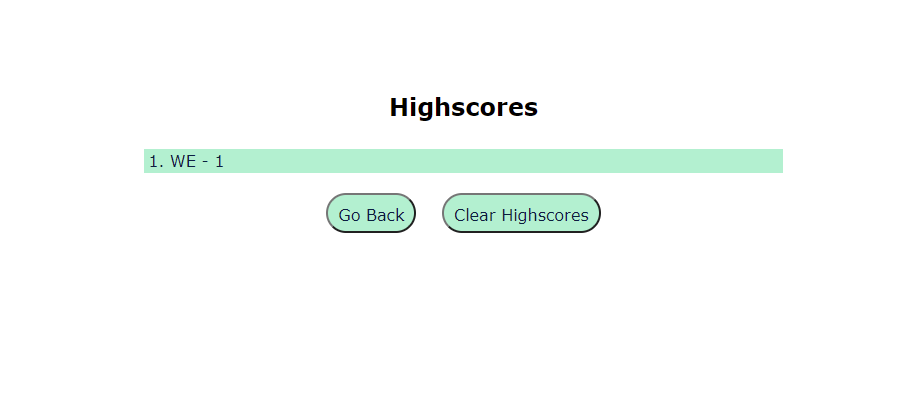
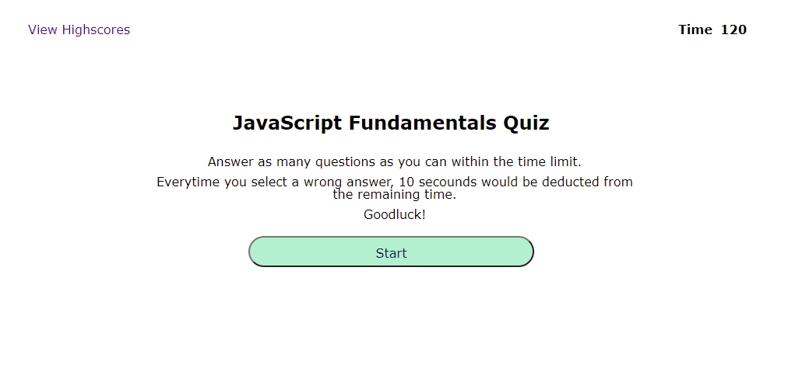

# JavaScript Fundamentals Timed Quiz

## Description

This program hopes to help full-stack developers test their knowledge of JavaScript fundamentals. This program is a timed quiz that will randomise a couple of questions about JavaScript along with four (4) possible answers. The user could select their answer and the program would prompt if that is correct or not. For another challenge, whenever an incorrect answer is selected, 10 secounds would be deducted to the current time. Once the time is up or all of the questions have been answered, the user can record their initials and scores and a list of their attempts can be seen on a different page. The list of scores can be reset and the user can also go back to the initial page to start the quiz again.

The program is done using HTML, CSS, and JavaScript.

## Instructions

You are given two minutes to answer several questions about Javascript fundamentals. For each question, there would be four (4) available choices. Select your answer by clicking on the choice you have selected. The application would prompt the next question if your answer is correct, otherwise your current time would be reduced by 10 seconds.

After finishing the game, you will be prompted to submit your initials and the highscores would be shown.

## Website

The following image shows the web application's appearance and functionality:

## Demo

Visit [this](https://alainatividad.github.io/JavaScript-Timed-Interactive-Quiz/index.html) to see the webapp in action.

## Credits

Most of the questions used in this application are from the following websites:

- https://www.interviewbit.com/javascript-mcq/
- https://www.interviewbit.com/javascript-interview-questions/
